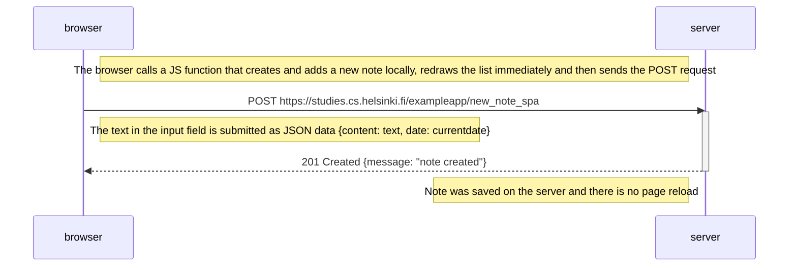

```mermaid
sequenceDiagram
    participant browser
    participant server

    Note right of browser: The browser calls a JS function that creates and adds a new note locally, redraws the list immediately and then sends the POST request
    browser->>server: POST https://studies.cs.helsinki.fi/exampleapp/new_note_spa
    activate server
    Note right of browser: The text in the input field is submitted as JSON data {content: text, date: currentdate}
    server-->>browser: 201 Created {message: "note created"}
    deactivate server
    Note left of server: Note was saved on the server and there is no page reload
```
